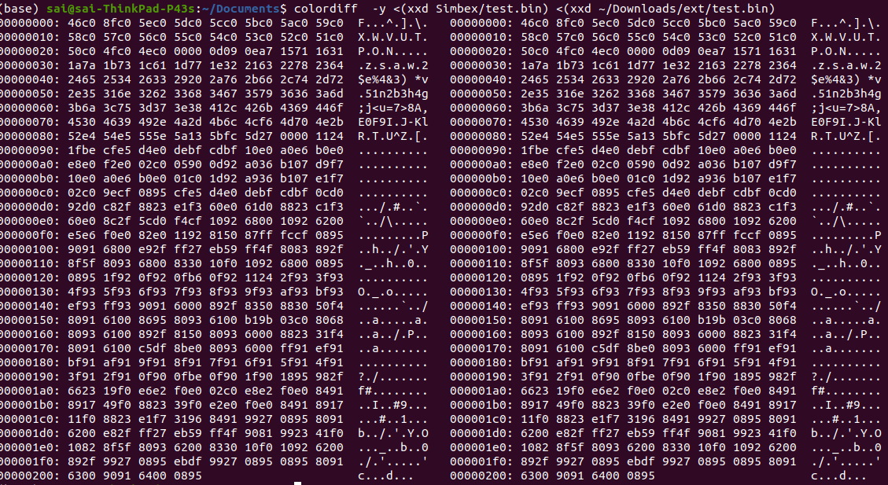

# Simbex
Simbex codes

SREC & CSV manipulation

SREC: 
Basic reading and checking for identifiers of the srec file
Writing the data part to a bin file

Using Macros for state machine makes it easy to read, less code size , removal of unwanted code enums and other functions

Comparing output file of program with respect to orginal file

